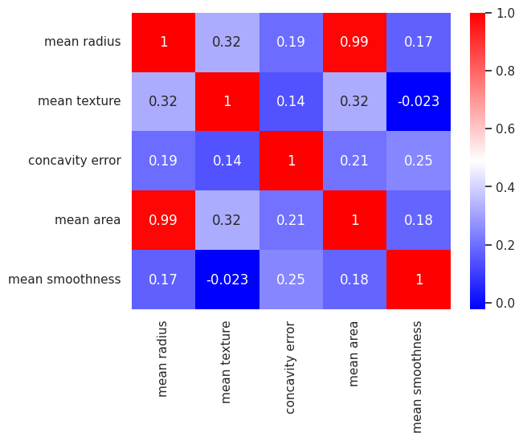

# Proyek Deteksi Kanker Payudara Menggunakan Machine Learning

Proyek ini bertujuan untuk mengembangkan model Machine Learning yang mampu mendeteksi kanker payudara (jinak/benign vs ganas/malignant) berdasarkan fitur-fitur klinis yang diekstrak dari dataset. Dengan fokus pada akurasi tinggi dan minimnya False Negatives untuk kasus ganas, model ini diharapkan dapat menjadi alat bantu yang berharga bagi tenaga medis dalam proses diagnosis awal.

## Dataset

Dataset yang digunakan dalam proyek ini adalah **Breast Cancer Wisconsin (Diagnostic) Dataset**. Dataset ini aslinya dikumpulkan di **University of Wisconsin Hospitals, Madison** dan tersedia melalui **UCI Machine Learning Repository**, yang kemudian diintegrasikan ke dalam library `scikit-learn` untuk kemudahan akses melalui fungsi `load_breast_cancer()`.

Dataset ini berisi fitur-fitur yang dihitung dari citra digital aspirasi jarum halus (FNA) dari massa payudara. Fitur-fitur ini menggambarkan karakteristik nukleus sel yang divisualisasikan.

* **Sumber Asli:** UCI Machine Learning Repository (University of Wisconsin Hospitals, Madison)
* **Jumlah Sampel:** 569
* **Jumlah Fitur:** 30 (misalnya, mean radius, mean texture, mean perimeter, mean area, dll.)
* **Kelas Target:**
    * 0: Malignant (Ganas)
    * 1: Benign (Jinak)

## Fitur Utama

* **Pembersihan Data & Pra-pemrosesan:** Menangani data mentah dan menyiapkan untuk pemodelan.
* **Analisis Data Eksploratif (EDA):** Memvisualisasikan distribusi fitur dan hubungan antar fitur, serta korelasi.
* **Pemodelan Machine Learning:** Implementasi algoritma Support Vector Machine (SVM) untuk klasifikasi.
* **Evaluasi Model:** Menilai kinerja model menggunakan metrik seperti akurasi, presisi, recall, F1-score, dan Confusion Matrix.

## Hasil

Model Support Vector Machine (SVM) yang dikembangkan menunjukkan performa yang sangat menjanjikan dalam mengklasifikasikan sel kanker payudara. Berikut adalah ringkasan hasil evaluasi pada data uji:

### Confusion Matrix
[[45  2]
[ 0 67]]
Visualisasi Confusion Matrix:

.png)

* **True Negative (TN): 45**
    * Model dengan benar memprediksi 45 kasus **jinak** sebagai jinak.
* **False Positive (FP): 2**
    * Model salah memprediksi 2 kasus **jinak** sebagai **ganas** (ini adalah kesalahan 'Type I').
* **False Negative (FN): 0**
    * Model salah memprediksi 0 kasus **ganas** sebagai **jinak** (ini adalah kesalahan 'Type II' dan yang paling kritis untuk diminimalisir dalam diagnosis kanker).
* **True Positive (TP): 67**
    * Model dengan benar memprediksi 67 kasus **ganas** sebagai ganas.

#### Confusion Matrix
|            | Prediksi 0 | Prediksi 1 |
|------------|------------|------------|
| Aktual 0   | 45         | 2          |
| Aktual 1   | 0          | 67         |

#### Classification Report
| Kelas | Precision | Recall | F1-Score | Support |
|-------|-----------|--------|----------|---------|
| 0     | 1.00      | 0.96   | 0.98     | 47      |
| 1     | 0.97      | 1.00   | 0.99     | 67      |
| **Accuracy** |       |        | **0.98** | **114** |
| Macro Avg | 0.99  | 0.98   | 0.98     | 114     |
| Weighted Avg | 0.98 | 0.98 | 0.98     | 114     |

**Akurasi Keseluruhan: 98.25%**                           
  
* **Akurasi Keseluruhan: 98.25%**
    * Proporsi prediksi benar secara keseluruhan.
* **Recall (Sensitivitas) untuk Kelas Malignant (Ganas): 1.00 (100%)**
    * Ini adalah metrik paling krusial. Model berhasil mengidentifikasi **semua** kasus kanker ganas yang ada di data uji. Ini berarti tidak ada kasus kanker ganas yang terlewat oleh model.
* **Presisi untuk Kelas Malignant (Ganas): 0.97**
    * Dari semua yang diprediksi sebagai ganas, 97% memang benar-benar ganas. Hanya ada 2 prediksi positif palsu.

### Visualisasi Data Eksploratif

#### Korelasi Antar Fitur



Heatmap korelasi menunjukkan hubungan linear antar fitur. Terlihat ada korelasi tinggi antara fitur-fitur yang terkait dengan ukuran tumor (misalnya, `mean radius` dan `mean area`).

#### Pair Plot Fitur

.png)

Pair plot ini menunjukkan distribusi setiap fitur dan hubungan antar pasangan fitur, dengan warna yang membedakan kelas target (status 0 atau 1). Terlihat pemisahan yang jelas antara kedua kelas untuk beberapa fitur kunci, menunjukkan bahwa fitur-fitur ini sangat prediktif.

## Cara Menjalankan Project (Local)

Untuk menjalankan proyek ini di mesin lokal Anda, ikuti langkah-langkah berikut:

1.  **Clone Repository:**
    ```bash
    git clone [https://github.com/NamaPenggunaAnda/NamaRepoAnda.git](https://github.com/NamaPenggunaAnda/NamaRepoAnda.git)
    cd NamaRepoAnda
    ```
    *(Ganti `NamaPenggunaAnda` dan `NamaRepoAnda` dengan yang sesuai)*

2.  **Buat Virtual Environment (Disarankan):**
    ```bash
    python -m venv venv
    # Di Windows
    venv\Scripts\activate
    # Di macOS/Linux
    source venv/bin/activate
    ```

3.  **Instal Dependensi:**
    ```bash
    pip install -r requirements.txt
    ```
    *(Jika Anda belum memiliki `requirements.txt`, Anda bisa membuatnya dengan `pip freeze > requirements.txt` setelah menginstal semua library yang digunakan dalam notebook, yaitu `pandas`, `scikit-learn`, `matplotlib`, `seaborn`)*

4.  **Jalankan Jupyter Notebook:**
    ```bash
    jupyter notebook Cancer_Detection.ipynb
    ```

5.  **Jelajahi Notebook:** Buka `Cancer_Detection.ipynb` di browser Anda dan jalankan sel-selnya untuk melihat alur kerja lengkap dari pra-pemrosesan data hingga evaluasi model.

## Potensi dan Pengembangan Selanjutnya

Model ini menunjukkan potensi yang sangat besar sebagai alat bantu deteksi kanker payudara. Langkah-langkah pengembangan di masa mendatang dapat meliputi:

* **Validasi Lanjut:** Melakukan pengujian cross-validation yang lebih ekstensif dan menguji model pada dataset independen yang lebih besar dan bervariasi.
* **Interpretasi Model (XAI):** Menerapkan teknik Explainable AI (seperti SHAP atau LIME) untuk memahami lebih dalam bagaimana model membuat keputusan, meningkatkan kepercayaan tenaga medis.
* **Integrasi Klinis:** Berkolaborasi dengan tenaga medis untuk mengintegrasikan model ke dalam alur kerja klinis yang ada, termasuk pengembangan antarmuka pengguna yang intuitif.
* **Pertimbangan Etika & Regulasi:** Memastikan kepatuhan terhadap standar privasi data pasien dan regulasi medis yang berlaku.
* **Optimasi Model:** Mengeksplorasi algoritma lain atau teknik tuning hyperparameter yang lebih lanjut untuk potensi peningkatan performa lebih lanjut.

## Kontribusi

Kontribusi dalam bentuk *bug reports*, *feature requests*, atau *pull requests* sangat kami hargai.

## Trimakasih untuk
* Pak Mega Bagus Herlambang yang sudah membimbing saya untuk project ini
* University of Wisconsin Hospitals yang telah menyediakan dataset 
